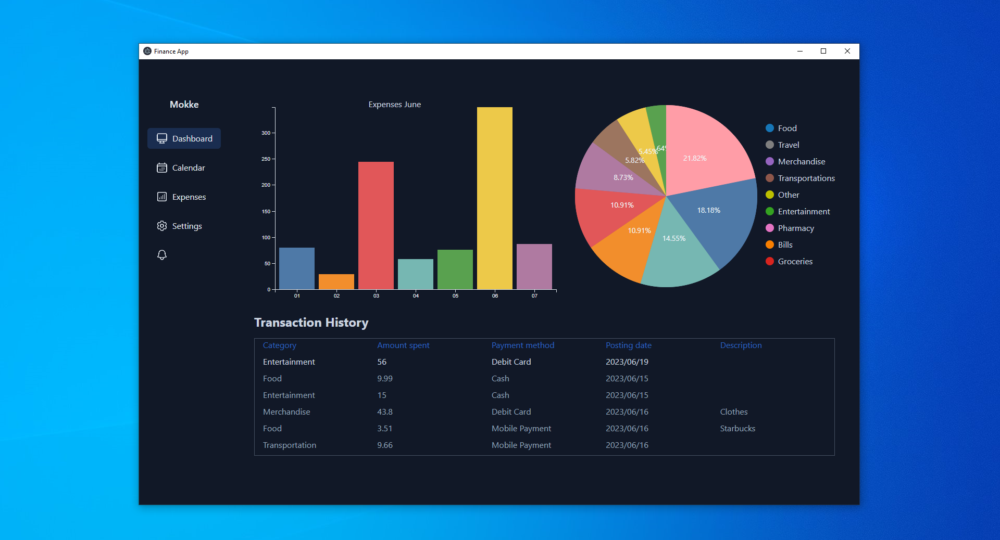

# Finance App Frontend

Desktop application for managing personal finances, created using Electron and React.

## Working Features

- Functionality to add and delete expenses.
- The main dashboard displays expenses for the current month in a bar chart, pie chart that illustrates the user's primary spending categories.
- Transaction history that displays recent expenses.

## Technologies Used Frontend

- React
- Electron
- HTML/CSS
- Tailwind css
- Typescript
- D3.js

## Prerequisites

- Node.js
- Npm

## Getting Started

Before running the frontend part of the application, make sure that backend is working and database is initialized.

1. Clone the repository:

   git clone https://github.com/Mokke29/finance-app-frontend.git

2. Navigate to the project directory:

    cd finance-app-frontend

3. Install npm packages:

    npm install

3. Running project for development/testing purposes:

    npm run electron:dev